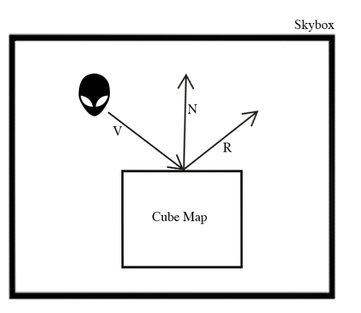
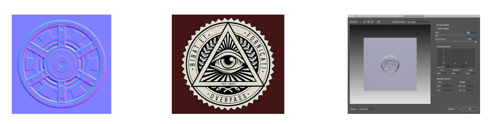

# TheNevadaDesertExperience
A project to learn more about data graphics with OpenGL.

The project uses following techniques:
* Cube Map/Skybox
* Environment mapping
* Normal Mapping

## Story
The Nevada Desert Experience is a virtual experience from the notorious Nevada Desert in the United States, which claims that the US defense in hiding is testing extraterrestrial technology. The authorities, for their part, are fueling rumors, claiming the area is a test site for developing secret weapons. In this program, you are a UFO enthusiast looking for extraterrestrial technology in the Nevada Desert, USA

## Object loading

## Cube Map/Skybox

## Normal Mapping

## Video
https://vimeo.com/380475211
